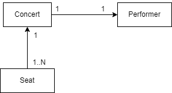

 Web Lab - Spring Data with MVC
 ====================
In this lab, we will develop a web application that support concert ticket's reservation. It consists of 2 parts: Admin and Front-end. We will only develop the admin part. The admin part is used to manage the concerts.  We will use Spring Data to manage the data that have relationships. We will use H2 as a database for this lab.

*** You can copy the code from the previous lab to start this lab. ***

## Develop Model
We will develop Model that has 3 entity classes according to the figure below.



### Concert
 `Concert`  will represent a concert. It should have proper annotation for JPA such as `@Entity`. The class will have the following attributes:
* `id`: This attribute will store the unique id of the concert. This attribute should have `@Id` and `@GeneratedValue` that has `GenerationType.IDENTITY`.
* `title`: This attribute will store the name of the concert.
* `date`: This attribute will store the date of the concert.

### Performer 
`Performer` will represent a performer. It should have proper annotation for JPA such as `@Entity`. The class will have the following attributes:
* `id`: This attribute will store the unique id of the performer. This attribute should have `@Id` and `@GeneratedValue` that has `GenerationType.IDENTITY`.
* `name`: This attribute will store the name of the performer.

### Seat
The class `Seat` will represent a seat. It should have proper annotation for JPA such as `@Entity`. The class will have the following attributes:
* `id`: This attribute will store the unique id of the seat. This attribute should have `@Id` and `@GeneratedValue` that has `GenerationType.IDENTITY`.
* `number`: This attribute will store the seat number of the seat.
* `zone`: This attribute will store the price of the seat.

### Relationship
The relationship between the entities are as follows:
* `Concert` has a relationship with `Performer`. This is a one-to-one relationship. A concert has one performer and a performer can perform in a concert. Please use `CascadeType.ALL` for this relationship, as we want to save/delete the performer when we save/delete the concert.

* `Seat` has a relationship with `Concert`. This is a many-to-one relationship. Many seats can belong to a concert. Please use `CascadeType.MERGE` for this relationship, as we want to save the seat to an existing concert.


There is `data.sql`, which initializes the database with some data. You can use this data to test your application.


## Develop Repository
- Review a repository class `ConcertRepository` that will manage the data. This class is complete, no modification needed. The repository will extend `CrudRepository` interface. Currently, we do not need any method in the repository. We will use the methods provided by `CrudRepository` interface.


- Develop a repository class `SeatRepository` that will manage the data. The repository will extend `CrudRepository` interface. Currently, we do not need any method in the repository. Add the following derived method
  * `findByConcertId`: This method will find all seats that belong to a concert with the given id.
  * `deleteByConcertId`: This method will delete all seats that belong to a concert with the given id.


We will use H2 as a database for this lab. The `application.properties` file contains the configuration for H2 database. Please do not change the configuration.


## Develop Controller
This controller is similar to the previous lab, except it uses `ConcertRepository` to manage data, instead of `HashMap`. 
We will develop a controller class `ConcertController` that will handle the HTTP requests. 

The following methods are similar to the previous lab. Please refer to the previous lab for more details. The code given in these methods are **complete**. You do not need to change the code.
  * `listConcerts`: This method will handle the HTTP GET request to `/concerts` URL. It will return the `concerts` view that will display the list of concerts.
  * `addAConcertForm`: This method will handle the HTTP GET request and return the `add-concert-form` view that will display the form to add a new concert.
  * `saveConcert`: This method will handle the HTTP POST request to `/concerts` URL. It will save the concert in the database and redirect to the `concerts` to list all concerts.

The following methods are new. Please complete the code in these methods.

  * `deleteConcert`: This method will handle the HTTP GET request to `/delete-concert/{id}` URL. It will delete the concert and related **seat** with the given id and redirect to the `concerts` to list all concerts. Please add `@Transactional` on top of this method to make sure concert and all its seats are deleted altogether.
  * `showAddSeatForm`: This method will handle the HTTP GET request to `/concerts/{id}/seats` URL, where `{id}` is concert id. It will return the `add-seat-form` view that will 1) display the form to add a new seat and 2) list all seat according to given concert id.
  * `addSeat`: This method will handle the HTTP POST request to `/concerts/{id}/seats` URL, where `{id}` is concert id. It will save the seat in the database and redirect to the `concerts/{id}/seats` to list all seats according to given concert id.

## Develop Views
 `list-concert.html` is complete. 

 - Complete `add-concert-form.html` as follows:
   * Add label and field in the form for performer name.
 
 - Complete `seat-mgmt.html` as follows:
    * Add a table to list all seats. The table should have the following columns:
        * `number`: This column will display the seat number of the seat.
        * `zone`: This column will display the price of the seat.
    * Add a form to add a new seat. The form should have the fields: `number` and `zone`. The form should have a submit button.

## Test Web App using Browser
Run the application using App.java class. Open the browser and go to `/concerts` as the following URL:

On local machine:
```
http://localhost:8100/concerts
```
Or if you use codespace:
```
https://<your-codespace-name>-8100.xxxxxxx.dev/concerts
```
You should be able to add concert, list all concerts, list all seats of a concert, and add seat to a concert.

## Unit Test
Run the unit tests in `ConcertControllerTest` class to test the service. You can run the tests using the following command:
```
mvn verify
```
